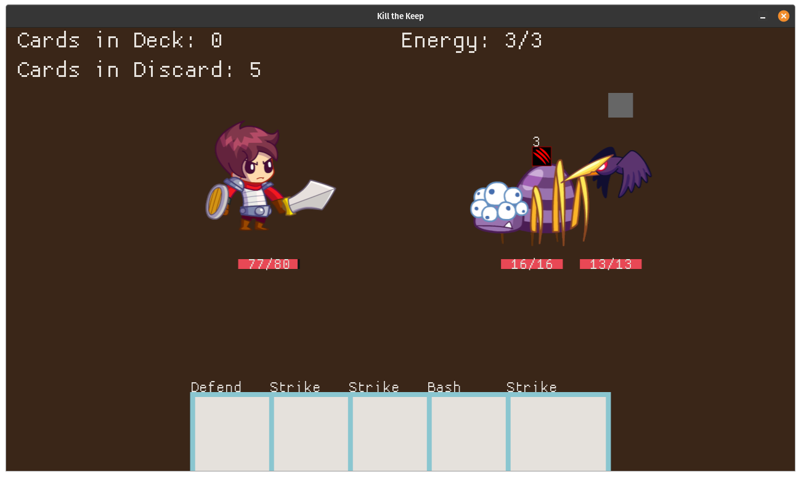

# Kill the Keep

A clone of Slay the Spire built in Rust with Macroquad and Legion ECS.

## Important Note: Art Assets Not Included

Due to licensing, I cannot share the art assets used in the screenshot above. If you wish to compile the game yourself, you'll have to provide your own assets. Details are provided on the resolutions needed in the assets/sprites folder.

## Known Issues

* Temporary Cards (Such as those created by Anger) are not removed at the end of combat. This could be solved by placing a temporary tag on them and removing temp cards at the end of combat.

* Upgrading cards is not implemented. As such, Armaments is withheld from the card pool.
